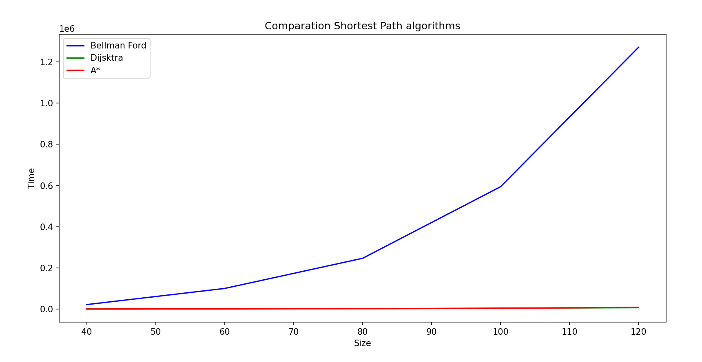
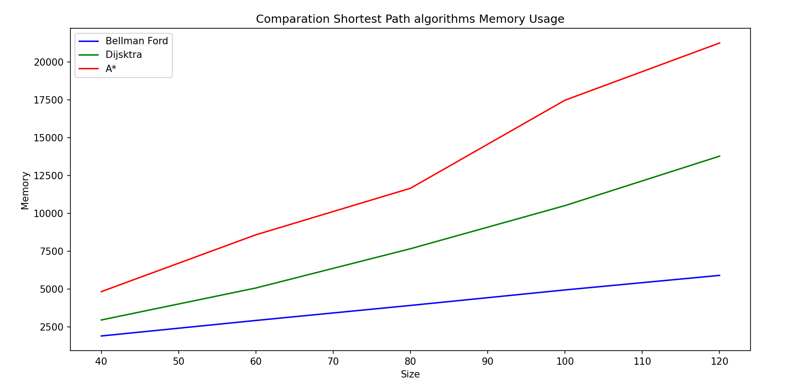
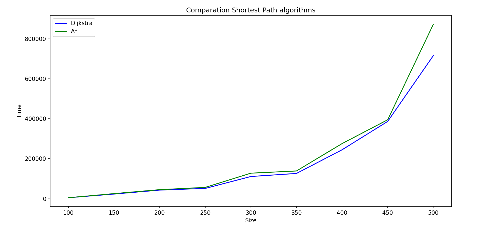
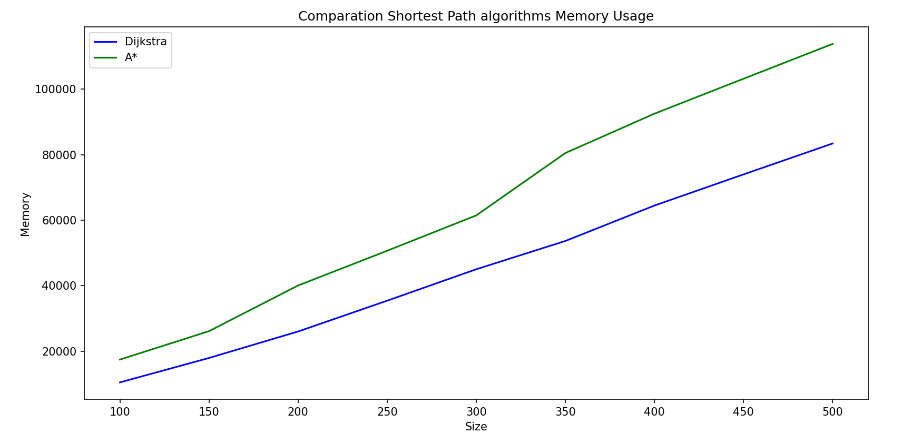

# About this repo

Simple python project to show a way to take experiental execution time to compare a set of algorithms (three in this case) in fair way.

## Shortest Path


### Problem statement
​
The sample problem is to find the shortest path in a Graph.

# Time and Space Complexity

| Algoritmo      | Best Case   | Worst Case           | Space | Negative Weight | Use cases Principal                      |
|---------------|-------------|---------------------|----------|-----------------|------------------------------------|
| Bellman-Ford  | O(VE)       | O(VE)              | O(V)     | ✅ Yes         | Graphs with negative weights        |
| Dijkstra (heap) | O(V log V)  | O((V + E) log V)   | O(V)     | ❌ No           | Graphs with Positive Weights, Traffic Networks |
| A*            | O(V)        | O((V + E) log V)   | O(V)     | ❌ No           | Map Searches, AI, Games   |


# Python version
Python 3.11.0
​
# Running locally and testing

* Note: This instructions are for mac. Windows or linux may require some changes. 
* A good idea for this project, is to use a virtual environment, you could set up one with: [virtualenv](https://virtualenv.pypa.io/en/latest/).
* To create the virtual environment: `virtualenv env`
* To activate it:`source env/bin/activate`
* To install dependencies: `pip3 install -r requirements.txt`
* To run unit testing: `./test.sh`
* To try a default example, run: `: ./run.sh`. In the file ./run.sh is just an example, you can modify it. Theck the `app.py` file to get to understand how it works.

# Visualization

## Comparison Bellman Ford, Dijsktra and A*

| Size | # Relations | Bellman Ford (Time, Memory) | Dijkstra (Time, Memory) | A* (Time, Memory) |
|------|------------|----------------------------------|----------------------------|-------------------------|
| 40   | 77         | (21498, 1904)                   | (0, 2960)                  | (0, 4832)               |
| 60   | 177        | (99945, 2928)                   | (0, 5072)                  | (1562, 8584)            |
| 80   | 294        | (246390, 3920)                  | (1576, 7664)               | (1577, 11656)           |
| 100  | 495        | (594242, 4944)                  | (4367, 10512)              | (3228, 17472)           |
| 120  | 658        | (1271239, 5904)                 | (6527, 13776)              | (8009, 21248)           |







## Comparison Dijsktra and A*

| Size | # Relations | Dijkstra (Time, Memory) | A* (Time, Memory) |
|------|------------|------------------------------|-------------------------|
| 100  | 506        | (4947, 10480)                | (4917, 17440)           |
| 150  | 1056       | (23287, 17936)               | (25482, 26128)          |
| 200  | 1845       | (43083, 26024)               | (45238, 40072)          |
| 250  | 2938       | (51528, 35432)               | (56606, 50680)          |
| 300  | 4398       | (111062, 45028)              | (127666, 61476)         |
| 350  | 6053       | (126326, 53668)              | (138774, 80524)         |
| 400  | 7762       | (244742, 64484)              | (275755, 92540)         |
| 450  | 10555      | (386637, 73996)              | (394791, 103212)        |
| 500  | 12342      | (715572, 83436)              | (872096, 113852)        |






# Current coverage

Make sure you have "coverage" in your requirements.txt file and run pip install. Then run `coverage run -m unittest discover` and after that run `coverage report` to get the following table:

```
Name                             Stmts   Miss  Cover
----------------------------------------------------
shortestpath\__init__.py             0      0   100%
shortestpath\algorithms.py          69      4    94%
shortestpath\constants.py            2      0   100%
shortestpath\data_generator.py      25      2    92%
test\__init__.py                     0      0   100%
test\test_algorithms.py             24      1    96%
test\test_data_generator.py         31      1    97%
----------------------------------------------------
TOTAL                              151      8    95%
```

# Code beautifier
This code has been beautify using black: https://github.com/psf/black. 
The command to use is `black . -l 120`.
